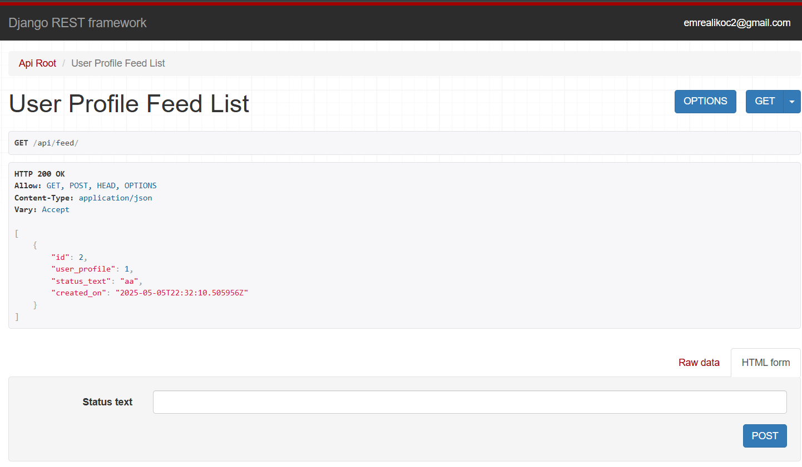

# Profiles REST API 🔗

Bu proje, Django ve Django REST Framework (DRF) kullanılarak geliştirilmiş bir *REST API* örneğidir. Kullanıcı profili oluşturma, listeleme, güncelleme ve token tabanlı kimlik doğrulama işlemlerini gerçekleştirebilirsiniz.

---

---

## Proje Amacı

Bu proje, Django REST Framework kullanarak REST API geliştirme pratiği yapmak isteyenler için temel bir örnektir. Kullanıcılar kayıt olabilir, profillerini düzenleyebilir ve token tabanlı authentication ile API uç noktalarına erişebilirler.

---

---

## API Özellikleri

- Kullanıcı Profili Oluşturma (POST)
- Kullanıcı Profili Listeleme (GET)
- Kullanıcı Profili Güncelleme (PUT/PATCH)
- Token Authentication (Login için Token alımı)
- Basit izin ve yetkilendirme sistemleri
- DRF ViewSets ve Serializers kullanımı

---

